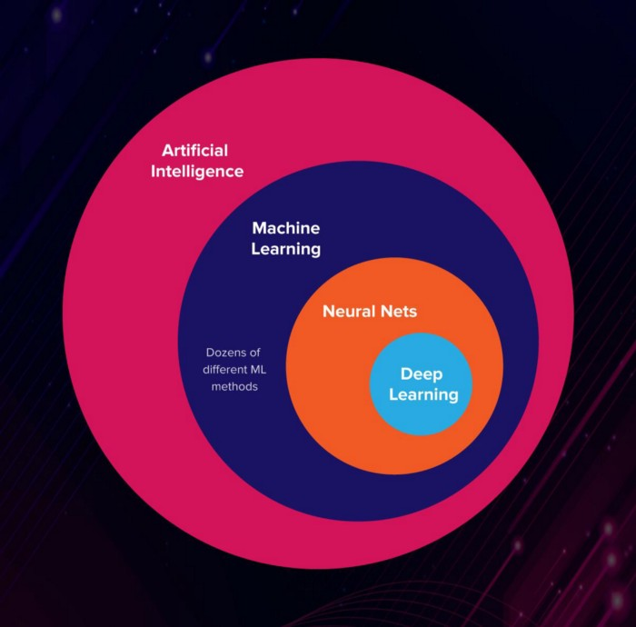

# Artificial Intelligence

 

<ul>

 __Artificial Intelligence__ is a science like mathematics or biology. It studies ways to build intelligent programs and machines that can creatively solve problems, which has always been considered a human prerogative.

 __Machine Learning__ is a subset of Artificial Intelligence (AI) that provides systems the ability to automatically learn and improve from experience without being explicitly programmed. In ML, there are different algorithms (e.g. neural networks) that help to solve problems.

 __Deep Neural Learning__ is a subset of Machine Learning, which uses the neural networks to analyze different factors with a structure that is similar to the human neural system.

</ul>

